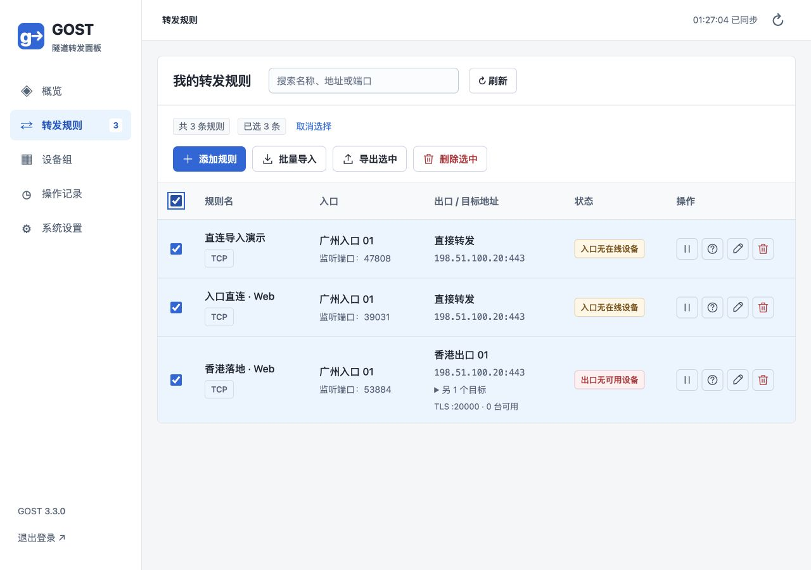

# GOST 隧道转发面板

中文自部署面板，管理「国内入口机 → TLS 隧道 → 出口机 → 国外落地机」三段转发。支持 TCP、UDP、多个目标地址、节点一键安装、配置自动同步及规则启停。参考 Nyanpass 的规则录入流程，适合管理自己服务器上的转发线路。



```text
用户 ──TCP / UDP──> 国内入口机 ──认证 TLS 隧道──> 出口机 ──TCP / UDP──> 国外落地机
                         ↑                         ↑
                         └──── HTTPS 拉取配置 ─────┘
                                  管理面板
```

面板不经手业务流量。落地机无需安装代理；面板、入口和出口通常使用独立服务器。入口主动连接出口，因此出口的隧道地址必须可从入口访问。这里的隧道是端口转发隧道，不是虚拟网卡 VPN 或反向 NAT 穿透。

## 一键安装面板

支持 **Ubuntu 22.04+ / Debian 12+ / Rocky Linux 9+ / AlmaLinux 9+**，要求 systemd、Python 3.9+、OpenSSL 1.1.1+。节点支持 Linux **amd64 / arm64**。无需 Docker、Node.js 或 pip 安装依赖。

在面板服务器执行：

```bash
curl -fsSL https://raw.githubusercontent.com/panhui/gost/main/scripts/install-panel.sh -o install-panel.sh
sudo bash install-panel.sh
```

按提示输入节点可访问的公网 HTTPS 地址，例如 `https://你的服务器IP:8443`，再设置至少 12 位管理员密码。脚本安装到 `/opt/gost-panel`，数据保存到 `/var/lib/gost-panel`，配置保存到 `/etc/gost-panel.env`，注册 `gost-panel.service` 并设置开机启动。

**在防火墙和云安全组放行面板 TCP 8443**，然后访问安装时输入的地址。默认生成自签名证书，首次浏览器访问需确认该证书。安装脚本内置同一份面板证书，节点会校验证书与服务器名称，不使用 `--insecure`。

如果其他 apt/dpkg 任务正在运行，依赖安装会自动等待前端锁释放，最多 10 分钟。超时后请检查对应进程，等待其正常结束，再重新执行安装；不要删除锁文件。

无人值守安装可预先设置环境变量；密码只在首次初始化时使用，不保存在服务环境文件中：

```bash
export GOST_PUBLIC_URL=https://panel.example.com:8443
read -rs GOST_ADMIN_PASSWORD; export GOST_ADMIN_PASSWORD; echo
sudo --preserve-env=GOST_PUBLIC_URL,GOST_ADMIN_PASSWORD bash install-panel.sh
unset GOST_ADMIN_PASSWORD
```

## 添加节点与规则

1. 进入「节点管理」，添加**国内入口机**，填写名称和公网 IP / 域名。
2. 点击「安装脚本」，复制命令，在入口服务器执行。也可下载 `.sh`，上传后执行 `sudo bash install-node.sh`。
3. 同样添加并安装**出口机**。公网地址应为入口机能够访问的 IP / 域名。
4. 在「转发规则」点击「添加转发规则」，按顺序填写名称、入口、监听端口、出口、目标地址。监听端口留空时，随机分配 `2000–60000` 中未被面板其他规则占用的端口。
5. 目标地址**每行一个**，空行忽略，例如：

   ```text
   198.51.100.20:443
   [2001:db8::20]:443
   origin.example.com:443
   ```

   多个目标由出口按轮询选择，每个新连接选择一个目标；存在连接失败时 GOST 会暂时避开失败目标。现有连接不会切换目标。
6. 「高级选项」可选择 TCP / UDP、自定义出口隧道端口、设置保存后启用或停用。出口隧道端口留空时从 `20000–59999` 分配，每条规则独占一个出口 TCP 端口。
7. 在两端配置同步后，通过 `入口机IP:监听端口` 接入。在线表示最近 40 秒收到心跳；**已生效表示两端 GOST 进程运行且配置版本匹配，不代表目标网络已探测可达**。

节点从面板 HTTPS 下载已缓存的 GOST 安装包，**无需国内节点直接访问 GitHub**。面板安装 / 更新时会预缓存 amd64 和 arm64 官方包，后续安装复用缓存；面板与节点两端均按固定 SHA256 校验，下载接口需要有效的安装凭证。首次预缓存未成功时，面板会在节点请求时重试。

代理约每 10 秒同步配置。首次节点上线也可能需要十几秒。安装命令不限时间，可重复使用；重新生成命令会撤销该节点旧的安装凭证，删除节点也会撤销。命令内含永久安装凭证，请妥善保管。重装节点会替换代理长期凭证；已有面板升级后，数据库中仍保留的旧安装凭证也变为不限时。

### 防火墙与端口

| 位置 | 放行方向与端口 |
| --- | --- |
| 面板 | 入站 TCP 面板端口（默认 8443）；节点需能访问该地址 |
| 入口 | 入站规则监听端口，按规则选择 TCP 或 UDP |
| 出口 | 入站每条规则的 **TCP 隧道端口**，建议仅允许入口 IP |
| 落地 | 允许出口访问目标 TCP / UDP 端口 |
| 节点安装 | 出站 HTTPS 到面板，下载安装脚本与缓存安装包 |
| 面板安装包缓存 | 面板出站 HTTPS 到 GitHub，首次下载各架构 GOST 固定版本 |

安装脚本**不会修改防火墙**。自动分配端口仅检查面板中的规则，无法预知服务器上的其他服务；若端口被其他程序占用，会显示启动失败并尝试恢复旧配置。

入口到出口使用 TLS 加密和每规则独立的 Relay 用户名/随机密码，入口验证出口证书及名称。出口固定转发到该规则目标列表，避免成为任意目标的开放代理。UDP 数据封装在 TLS/TCP 中，丢包时可能出现队头阻塞。出口到落地使用落地服务自身协议，是否加密取决于该服务。

## 服务管理与维护

```bash
# 面板
sudo systemctl status gost-panel
sudo journalctl -u gost-panel -f
sudo systemctl restart gost-panel

# 入口 / 出口
sudo systemctl status gost-agent
sudo journalctl -u gost-agent -f
sudo systemctl restart gost-agent
```

面板和节点代理均使用专用系统用户。GOST 由节点代理作为子进程管理，绑定 1024 以下端口使用 `CAP_NET_BIND_SERVICE`，无需整个代理以 root 运行。

- **规则配置更新会重启该节点整个 GOST 进程，现有连接会中断。** 启动失败时尝试恢复上一个成功版本，并在面板显示错误。频繁调整规则时请安排维护窗口。
- 面板短暂不可达时，节点保留已应用配置继续转发；代理重启后可使用本地缓存恢复转发。
- 删除节点前需删除关联规则。在线代理收到凭证失效后停止转发，并保存撤销标记；离线节点无法立即收到删除通知，需要在服务器手动停止服务。
- 修改管理员密码会注销所有会话。登录尝试有速率限制，Cookie 使用 HttpOnly / Secure / SameSite=Strict，写入接口需 CSRF 校验。
- 面板不提供用量计费、限速配额、流量统计、IPv6 外网探测或出口负载均衡。多个目标地址的轮询属于落地目标选择。

### 备份与恢复

数据库和证书包含节点凭证，请只保存到受保护的位置。先停止面板再备份整个数据目录，避免 SQLite WAL 未合并导致备份不完整：

```bash
sudo systemctl stop gost-panel
sudo tar -czf gost-panel-backup.tar.gz -C /var/lib gost-panel
sudo systemctl start gost-panel
```

恢复时停止面板、还原到 `/var/lib/gost-panel`，执行 `sudo chown -R gost-panel:gost-panel /var/lib/gost-panel` 后启动。需要保留原面板证书和数据库，已有代理才能继续使用原凭证。备份节点时保存 `/var/lib/gost-agent`。

### 升级 / 回退

新版安装后，在「系统设置」点击「一键升级面板」即可升级到 GitHub `main` 最新提交。界面显示进度和结果，重启后自动恢复连接。专用 systemd 升级服务执行固定仓库、固定路径的更新；普通面板服务仍以非 root 身份运行。升级自动备份 SQLite 数据库到 `/var/lib/gost-panel-upgrade/panel-before-upgrade.db`（root 可读），保留证书、密码、节点和规则；新版本未通过本地 HTTPS 健康检查时尝试恢复旧代码和数据库。服务日志：`sudo journalctl -u gost-panel-upgrade -n 100 --no-pager`。

**旧部署需要先重新执行一次新版面板安装脚本**，安装升级服务后才可使用按钮。一键升级仅更新面板，节点代理如需更新仍需重新安装；面板重启期间已运行的转发继续使用节点缓存配置。

重新执行面板安装脚本会更新代码，保留数据和证书，上一版代码保存到 `/opt/gost-panel.previous`。升级前请备份数据。也可通过 `GOST_PANEL_REF` 指定 GitHub tag / commit：

```bash
sudo GOST_PUBLIC_URL=https://panel.example.com:8443 GOST_PANEL_REF=v0.1.0 bash install-panel.sh
```

回退时停止面板，将 `/opt/gost-panel.previous` 恢复到 `/opt/gost-panel` 再启动。该版本仅有向后兼容的 SQLite 新字段迁移；未来版本请参考发行说明。节点代理升级需重新生成安装脚本并重装。

### 国内节点安装下载缓慢

新版节点脚本从面板缓存下载 GOST。旧面板需先重新执行面板安装脚本升级，然后重新生成节点脚本；旧的已下载脚本仍使用 GitHub 地址。面板升级保留数据库、密码和证书。

缓存目录为 `/var/lib/gost-panel/downloads`。可在面板服务器手动预缓存：

```bash
sudo -u gost-panel python3 /opt/gost-panel/cache.py --directory /var/lib/gost-panel/downloads
```

如果面板服务器访问 GitHub 也慢，可在能快速访问 GitHub 的机器下载官方 `gost_3.3.0_linux_amd64.tar.gz` / `gost_3.3.0_linux_arm64.tar.gz`，上传到该缓存目录，再执行 `sudo chown -R gost-panel:gost-panel /var/lib/gost-panel/downloads`。面板只会提供与 `core.py` 固定 SHA256 匹配的包；错误包会触发重新下载，不能跳过校验。节点实际速度仍受面板到国内服务器之间的网络影响。

### 使用可信证书 / 反向代理

可将可信证书及私钥放入数据目录，配置 `/etc/gost-panel.env` 中的 `GOST_TLS_CERT` / `GOST_TLS_KEY`，确保证书与面板 URL 的域名匹配。替换面板证书后，**重新生成脚本并安装节点**，更新节点固定信任证书。内置证书有效期 10 年；证书续期也需更新节点信任。

反向代理可监听公网 HTTPS 443，再转发到面板 HTTPS 8443。需手动把 `GOST_PUBLIC_URL` 设置为公网根地址。生成节点脚本时使用的 `GOST_TLS_CERT` 必须是代理对外提供的同一证书/信任链；面板也要使用该证书，或另行配置独立 TLS 终结方案。自动安装脚本面向直连 HTTPS >=1024 端口。

### 卸载

面板：`sudo systemctl disable --now gost-panel-upgrade.path gost-panel`，再删除 `/etc/systemd/system/gost-panel-upgrade.path`、`/etc/systemd/system/gost-panel-upgrade.service`、`/etc/systemd/system/gost-panel.service`、`/opt/gost-panel`、`/etc/gost-panel.env`，执行 `sudo systemctl daemon-reload`。节点对应停止 `gost-agent`，删除服务文件、`/opt/gost-agent` 与 `/usr/local/bin/gost`。请确认 GOST 二进制未被其他服务使用。数据目录和系统用户可在确认备份后手动移除。

### 线路不通与 DNS

「配置已应用」仅表示两端代理已加载规则，不代表业务连通。规则行的「诊断」由面板服务器检查入口地址解析和 TCP 监听、出口 TLS 证书及 Relay 认证；TCP 规则还验证出口是否能连接本次选中的落地目标。诊断不会发送业务协议数据，也不能替代入口机器到出口的实际路由或 UDP 应用响应测试。出口仅放行入口 IP 时，面板发起的诊断可能被防火墙拒绝。

日志出现 `lookup ... no such host` 表示域名无法解析。在「节点管理」编辑对应节点，改为正确的公网 IP，或给域名添加 A/AAAA 记录。保存节点地址后代理约 10 秒同步，无需重装；出口证书校验仍使用节点独立名称，不依赖公网地址。客户端应连接入口公网地址与入口监听端口；出口需要放行该规则的 **TCP 隧道端口**，其值在规则列表可见。随后查看入口与出口日志：`sudo journalctl -u gost-agent -n 60 --no-pager`。

## 开发与测试

Python 3.9+，前端为原生 HTML/CSS/JavaScript，Python 标准库 HTTP API + SQLite，运行时无第三方 Python 依赖。服务端原生 HTTPS，代理不开放远程管理端口。

```bash
# 仅本机开发允许 HTTP，不支持生成节点安装脚本
GOST_ALLOW_HTTP=1 GOST_PUBLIC_URL=http://127.0.0.1:8080 \
GOST_ADMIN_PASSWORD=local-development-password \
python3 app.py --host 127.0.0.1 --port 8080

# API、输入校验、凭证生命周期、CSRF 和安装脚本语法测试
python3 -m unittest discover -s tests -v

# 下载官方 GOST 3.3.0 并校验发布 SHA256 后运行真实隧道测试
GOST_BINARY=/绝对路径/gost python3 -m unittest discover -s tests -v
```

GitHub Actions 在 Python 3.9 / 3.12 与 Linux 上执行真实 TCP/UDP 转发测试，包括多目标轮询、错误凭证、证书名称校验、端口冲突回退、规则停用、面板中断和节点重启后的持续转发。另有 Ubuntu systemd 安装冒烟测试，实际执行面板及节点安装脚本并检查专用用户、节点上线和配置同步。

| 文件 | 用途 |
| --- | --- |
| `app.py` | HTTPS 面板 API、登录会话、CSRF 与静态资源 |
| `core.py` | SQLite 数据、校验、GOST 配置生成 |
| `agent.py` | 注册、配置轮询、GOST 子进程与回退 |
| `installers.py` | 自包含节点安装脚本与固定证书命令 |
| `cache.py` | 官方 GOST 安装包缓存、校验与预下载 |
| `scripts/install-panel.sh` | 面板安装 / 更新与 systemd 服务 |
| `static/` | 中文管理界面 |
| `tests/` | 单元、API 与真实 GOST 集成测试 |

GOST 固定为 **3.3.0**，下载官方二进制并校验仓库内固定 SHA256。相关配置依据 [GOST 端口转发](https://gost.run/en/tutorials/port-forwarding/)、[TLS](https://gost.run/en/tutorials/tls/) 与 [Relay](https://gost.run/en/reference/handlers/relay/) 文档实现。本项目是独立管理面板，与 GOST / Nyanpass 官方无从属关系。面板代码使用 MIT 许可；GOST 二进制遵循其上游许可。
